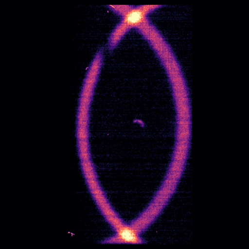

# SPDC en BBO — simulador de phase matching

App interactiva para explorar la **conversión paramétrica descendente espontánea
(SPDC)** en un cristal de β-BaB₂O₄ (BBO): dónde sale cada fotón del par, cómo cambia
el patrón con el corte del cristal y con la longitud de onda del bombeo, y cómo se ve
todo eso proyectado sobre una cámara.

Todos los parámetros —corte del cristal, bombeo, longitud de onda del signal, waist,
largo del cristal, azimut, óptica de la cámara— son *sliders*. Cada figura se puede
descargar en PDF o PNG, y los datos que dibuja en CSV.



---

## Instalación

Hace falta **Python 3.11 o más nuevo**. Cualquiera de los dos caminos sirve.

### Con `uv` (recomendado, más rápido)

[`uv`](https://docs.astral.sh/uv/) resuelve el entorno solo, no hay que crear un venv
a mano.

```bash
git clone https://github.com/julimarilia/SPDC_BBO_app.git
cd SPDC_BBO_app
uv run streamlit run app.py
```

La primera vez baja las dependencias; después arranca en segundos.

### Con `pip`

```bash
git clone https://github.com/julimarilia/SPDC_BBO_app.git
cd SPDC_BBO_app

python -m venv .venv
source .venv/bin/activate        # Windows:  .venv\Scripts\activate

pip install -r requirements.txt
streamlit run app.py
```

En los dos casos se abre solo el navegador en `http://localhost:8501`. Si no se abre,
entrá a esa dirección a mano. Para cerrar, `Ctrl+C` en la terminal.

> **Importante:** hay que correr el comando **parado en la carpeta del repo**, porque
> Streamlit busca `.streamlit/config.toml` relativo al directorio de trabajo. Si lo
> corrés desde otro lado la app funciona igual, pero sin el tema visual.

---

## Cómo se usa

Todo el control está en la **barra lateral izquierda**.

**1 · Elegí el tipo de cristal.** Tipo I o tipo II. No es un detalle cosmético: cambia
qué índice de refracción ve el signal y con eso la forma entera del patrón.

- **Tipo II** — signal y idler tienen polarizaciones ortogonales. El patrón son **dos
  anillos que se cruzan**, uno por fotón, desplazados del eje del bombeo por el
  *walk-off*. Corte útil: 38–48°.
- **Tipo I** — los dos fotones son ordinarios. El anillo es **un círculo exacto
  centrado en el bombeo**, sin cruces. Corte útil: 28.5–34°.

**2 · Elegí la figura** del catálogo. Cada una lista abajo qué muestra.

**3 · Movés los sliders y apretás «Actualizar».** Los parámetros físicos se aplican al
confirmar el formulario; las opciones de presentación (grilla, escala de color,
comparación) se aplican al instante, sin recalcular.

**4 · Descargás** la figura en PDF vectorial o PNG, y los datos en CSV.

### Si la app dice que no hay phase matching

Por debajo de cierto ángulo de corte no existe solución degenerada: el cono se cierra.
Ese umbral —el *onset* colineal— está en **41.79°** para tipo II y **28.82°** para
tipo I, a 405 nm de bombeo, y se mueve con el bombeo. Debajo de él la app avisa en vez
de dibujar un anillo de radio cero.

Justo *en* el onset el phase matching perfecto tampoco cierra el anillo para todo
azimut: quedan arcos abiertos. Es físico, no un problema numérico. Para anillos
cerrados en tipo II conviene usar cortes ≥ 42°.

---

## El catálogo

| figura | qué muestra | tipo |
|---|---|---|
| **Índices de refracción del BBO** | n_o y n_e por las ecuaciones de Sellmeier. Es el punto de partida: de la diferencia entre esos dos índices sale todo lo demás. | — |
| **Ángulo de emisión cerca de la degeneración** | A qué ángulo salen signal e idler para cada λ del signal, en una ventana angosta alrededor de la degeneración. | I / II |
| **Anillos de emisión** | Los conos vistos de frente. Dentro del cristal o ya refractados al aire por Snell, y en ese caso proyectados a una cámara (píxeles) o a un detector (mm). | I / II |
| **Curvas de sintonía** | Ángulo contra longitud de onda sobre todo el rango y para las dos ramas del cono. La parábola es la firma del phase matching. | I / II |
| **Mapa de phase matching: cálculo vs. simulación** | El mapa analítico de intensidad en (θs, θi) contra el histograma de los pares sorteados de ese mismo mapa. | I / II |
| **Distribución angular de los pares** | Histograma de θ_signal y −θ_idler de los pares sorteados. | I / II |
| **Fotones simulados sobre el detector** | Cada punto es un fotón. El signal sale en φs y su idler en φs + 180°. | I / II |
| **Distribución angular por longitud de onda** | El histograma angular acumulado sobre un barrido en λ, con un color por longitud de onda. | I / II |

---

## Los parámetros

| parámetro | qué es | qué controla |
|---|---|---|
| `cut` | ángulo de corte del cristal (°) | el radio del anillo. Es el parámetro más sensible |
| `lp` | longitud de onda del bombeo (nm) | fija la degeneración en 2·λp |
| `ls` | longitud de onda del signal (nm) | la del idler sale por conservación de energía |
| `phi_s` | azimut del signal (°) | en tipo II el anillo **no** es circular: recorrerlo cambia el ángulo |
| `w` | waist del bombeo (µm) | el ancho transversal de la función de phase matching |
| `L` | largo del cristal (mm) | el ancho del sinc² longitudinal |
| `f_lente`, `pixel_size` | óptica de la cámara | la proyección de los ángulos a píxeles |
| `puntos`, `N_pares` | grilla y estadística | resolución del mapa y cuántos pares se sortean |

La longitud de onda del idler nunca es un parámetro libre: sale de la conservación de
la energía, `1/λi = 1/λp − 1/λs`.

---

## Qué hay adentro

```
app.py                interfaz: catálogo, sliders y render
registro.py           qué figura ofrece la app y con qué parámetros
fisica.py             el núcleo: Sellmeier, phase matching e ITS
estilo.py             colores y estilo de las figuras
graficos/             el cómputo de cada figura
  sellmeier.py          índices y ángulo de emisión vs λ
  anillos.py            los anillos, dentro o fuera del cristal
  parabolas.py          curvas de sintonía
  its.py                muestreo por Inverse Transform Sampling
```

**El corazón es `fisica.py`.** Dada una dirección de emisión calcula el desajuste de
fase `Δk = k_p − k_s − k_i`: arma los versores de propagación, rota al marco del
cristal, saca los índices por Sellmeier, resuelve la ecuación de Fresnel de las
normales de onda y compone los tres vectores de onda. La función de phase matching es
un sinc² longitudinal por una gaussiana transversal, y los pares se sortean de ese
mapa por **Inverse Transform Sampling**: se normaliza como densidad de probabilidad,
se acumula y se invierte contra números uniformes.

Los ángulos de las figuras del patrón van **refractados al aire** por Snell, que es lo
que se mide en el laboratorio. Los internos son ~1.6 veces más chicos.

---

## Agregar una figura

En `registro.py`, una función decorada:

```python
@register_plot(
    name="Nombre de la figura",
    figsize=(7, 3.0),
    params=["cut", "lp", "ls", "w", "L"],
    description="Descripción breve.",
)
def _nueva(cut, lp, ls, w, L):
    return plot_algo(cut, lp, ls, w, L)
```

Los sliders salen de `PARAM_DEFS` en `app.py` y aparecen solos según la lista
`params`. Si la figura depende del tipo de cristal, marcala con `soporta_tipo=True` y
agregale un argumento `tipo='II'`. El cómputo va en `graficos/`, no en `registro.py`.

---

## Contexto

Este simulador es parte de una tesis de licenciatura en Física (FCEyN, UBA) sobre
generación de pares de fotones por SPDC tipo II en BBO y su detección con una
**Skipper-CCD**, hecha entre el Laboratorio de Óptica Cuántica del DEILAP (CITEDEF) y
el LAMBDA (Departamento de Física, FCEyN–UBA).

Se publica por separado porque la simulación se sostiene sola: sirve para diseñar o
entender una fuente de pares por SPDC en BBO sin nada del resto del trabajo.
